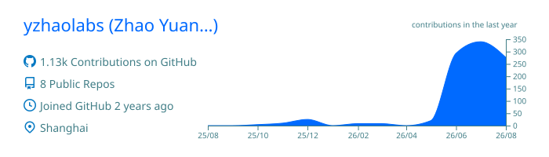
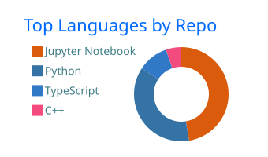
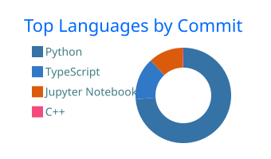
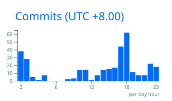

# Hi there >_<

🎓 Physics & Data Science

💡 Machine Learning · Deep Learning · AI Agents · Reinforcement Learning

📈 Quantitative Research · Financial Market Forecasting · Market Microstructure

---

## GitHub Overview

  

  
  

## Language Distribution

  
  

## Coding Activity

  

